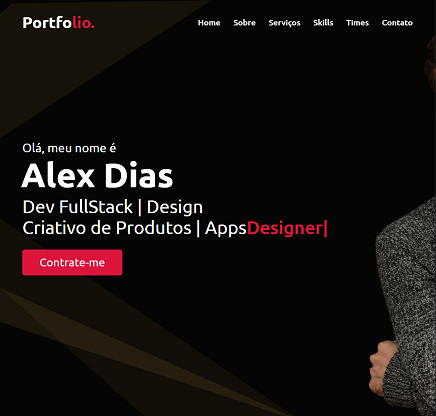

# 🌐 Portfólio | Alex Dias

## 🧑‍💻 Sobre mim

Olá! Meu nome é **Alex Dias**, sou **Desenvolvedor FullStack** com foco em **Design Criativo de Produtos e Aplicações**.

Gosto de criar soluções digitais modernas, intuitivas e funcionais. Tenho experiência em **front-end**, **back-end**, e **design UI/UX**, unindo estética e performance em cada projeto.

---

## 📖 Minha História

Sou apaixonado por tecnologia e design, e desde cedo desenvolvo projetos que unem lógica, criatividade e propósito.
Atualmente, trabalho no desenvolvimento de sistemas, aplicações web e aplicativos móveis com foco em **experiência do usuário**.

📄 [Baixar CV](#)

---

## 🛠️ Meus Serviços

| Categoria             | Descrição                                            |
| --------------------- | ---------------------------------------------------- |
| 💻 **Web Design**     | Criação de sites modernos, responsivos e otimizados. |
| 🎨 **Design Gráfico** | Identidade visual, logotipos, banners e interfaces.  |
| 🧩 **UI/UX Design**   | Protótipos interativos e design centrado no usuário. |

---

## ⚙️ Minhas Habilidades

| Skill                    | Nível |
| ------------------------ | ----- |
| HTML                     | 100%  |
| CSS                      | 100%  |
| JavaScript               | 100%  |
| React / Next.js          | 100%  |
| Node.js / API REST       | 100%  |
| Bubble APP Dev           | 100%  |
| Java                     | 100%  |
| Python                   | 100%  |
| SQL / PostgreSQL / MySQL | 100%  |
| Kotlin (Android Studio)  | 100%  |

📘 *Minhas habilidades refletem anos de prática e paixão por desenvolvimento e design.*

---

## 🚀 Projetos

Aqui estão alguns dos meus projetos desenvolvidos:

* **Sistema de consulta de condutores e veículos** — Aplicação para busca de dados de motoristas e veículos.
* **Sistema de Biblioteca** — Sistema completo de cadastro e controle de empréstimos de livros.
* **Web Site DocFamily** — Website moderno e otimizado para apresentação institucional.
* **Web Site Academia Fitness** — Site informativo com área administrativa e gerenciamento de alunos.
* **App Fluxo de Caixa Mobile** — Aplicativo de controle financeiro e gerenciamento de despesas pessoais.
* **App Calculadora IMC** — Aplicativo para cálculo de Índice de Massa Corporal.
* **App CRUD Clientes** — CRUD completo em HTML, CSS, JAVASCRIPT, FETCH, ASYNC/WAIT.
* **APP APP Juros Compostos** — Aplicativo mobile para calculo de juros compostos.
* **APP To Do List** — Aplicativo para gerenciamento de tarefas.
* **App Consumo de API Viacep** — Projeto integrando API do viacep, e interface mobile.

---

## 📫 Contato

Quer conversar sobre tecnologia, design ou possíveis colaborações?

📍 **Local:**  - Brasil

📧 **E-mail:** [ale.xxdias@hotmail.com](mailto:ale.xxdias@hotmail.com)
🌐 **Site:** [alexdiasdev-full.vercel.app](#) 
---

📱 **LinkedIn / GitHub:**

* [linkedin.com/in/alexdias](#)
* [github.com/alexdiasdev-full](#)

---

## 📝 Créditos

Design e código criados por **Alex Web Design** © 2025 | Todos os direitos reservados.
 

---

